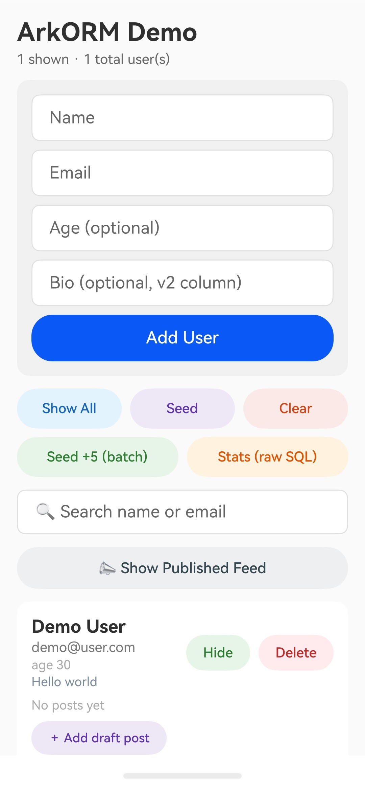

# ArkORM Demo — HarmonyOS Example App

<div>

</div>

A small but **complete** HarmonyOS Next (ArkTS) application that demonstrates
**[ArkORM](https://ohpm.openharmony.cn/#/en/detail/@explore-in-hmos%2Farkorm)** — a type-safe, pure-ArkTS
ORM for HarmonyOS (Android-Room-inspired).

It is a tiny "users & posts" manager wired to a real SQLite-backed `RdbStore`, and it
exercises **every major ArkORM feature**: decorators, the fluent query builder, relations
(eager & lazy), transactions, custom type converters, conflict strategies, raw SQL, and a
three-step schema migration (v1 → v2 → v3).

> Built for learning. Read the code top-to-bottom and you've seen the whole ArkORM surface.

---

## ✨ What it demonstrates

| Area | ArkORM feature | Where to look |
|---|---|---|
| **Schema** | `@Table`, `@Column`, `@PrimaryKey(autoGenerate)`, `@Unique`, `@Index`, `@Column({ defaultValue })` | `entity/User.ets`, `entity/Post.ets` |
| **Relations** | `@ForeignKey` (`ON DELETE CASCADE`), `@ManyToOne`, `@OneToMany`, `@EagerLoad` | `entity/User.ets`, `entity/Post.ets` |
| **Type conversion** | built-in `DateConverter`, **custom** `PropertyConverter` (`string[]` ⇄ JSON) | `entity/StringListConverter.ets` |
| **Database** | `@Database`, `securityLevel`, `onCreate` / `onUpgrade` hooks | `database/AppDatabase.ets` |
| **Migrations** | manual `Migration` (v1→v2, v2→v3) + automatic migration | `database/Migrations.ets` |
| **CRUD** | `insert` (+ `OnConflictStrategy`), `insertAll` (batch), `update`, `delete`, `query().delete()` | `database/DbService.ets` |
| **Query builder** | `where/and/or`, `eq`, `gte`, `like`, `isNotNull`, `exists`, `count`, `findOne`, `findAll`, `findPage`/`PageResult`, `orderBy` | `database/DbService.ets` |
| **Relation loading** | eager via `.eager('posts')`, lazy via `.load(entity, 'posts')`, auto via `@EagerLoad` | `database/DbService.ets` |
| **Transactions** | `db.transaction(tx => …)` with automatic rollback | `DbService.seedDemo()` |
| **Raw SQL** | `rawQuery<T>(…)`, `rawResultSet(…)` | `DbService.statsReport()` |
| **Lifecycle** | `ArkORM.init` / `getDatabase` / `close`, `setDebugLog` | `DbService`, page lifecycle |

---

## 📱 The app

A single page (`pages/Index.ets`) with:

- **Add form** — name, email, age, bio → `insert` with a duplicate-email pre-check (`exists()`).
- **Adults Only** — toggles a fluent query (`where('age').gte(18).and('email').isNotNull()`).
- **Seed** — inserts 2 users + 2 posts inside one **transaction**.
- **Seed +5 (batch)** — idempotent batch insert using `OnConflictStrategy.IGNORE`.
- **Stats (raw SQL)** — a one-line report built from `rawResultSet` + `rawQuery` + `findPage`.
- **Search** — name **OR** email via `like` + `or`.
- **Published feed** — switches the list to published posts only; authors are auto-filled by `@EagerLoad`.
- **Per-user posts** — expand to lazy-load posts, add a draft, and tap a post to flip **published ⇄ draft**.

---

## 🧱 Tech stack & requirements

- **HarmonyOS Next / API 12+** (ArkORM requires API 12 or newer)
- **DevEco Studio** (with the matching HarmonyOS SDK)
- **ArkTS** (strict mode), Stage model
- **@explore-in-hmos/arkorm** `^1.0.0` (declared in `entry/oh-package.json5`)

---

## 🗂️ Project structure

```
entry/src/main/ets/
├── entity/
│   ├── User.ets               @Table/@PrimaryKey/@Unique/@Index, Date via DateConverter, @OneToMany
│   ├── Post.ets               @ForeignKey(CASCADE), @ManyToOne + @EagerLoad, tags via custom converter
│   └── StringListConverter.ets  custom PropertyConverter: string[] ⇄ JSON TEXT
├── database/
│   ├── AppDatabase.ets        @Database (identity marker): entities, version, hooks, securityLevel
│   ├── Migrations.ets         MIGRATION_1_2 (published), MIGRATION_2_3 (tags)
│   └── DbService.ets          all ArkORM usage lives here — the UI never touches the ORM directly
└── pages/
    └── Index.ets              the single-screen UI
```

---

## 🚀 Getting started

1. **Clone** and open the project folder in **DevEco Studio**.
2. Let DevEco run **`ohpm install`** (or `File → Sync`). `arkorm` is already a dependency in
   `entry/oh-package.json5`; no manual step needed.
3. Pick a **device or emulator** (HarmonyOS Next).
4. Click **Run ▶**.

On first launch ArkORM creates `arkorm_demo.db`, builds the schema from the entity metadata,
and fires the `onCreate` hook. Tap **Seed** to populate sample data.

> Debug SQL/DDL is logged to **hilog** (`ArkORM.setDebugLog(true)` in `DbService.init`) — filter the
> log by the `ArkORM` tag to watch the generated statements and migration steps.

---

## 🔄 How the schema & migrations work

The database `version` drives migration. On open, manual `Migration`s run **in order first**, then
**automatic** migration fills any remaining gaps (new tables → `CREATE`, new columns → `ALTER ADD`,
new indexes → created).

| Version | Change | Handled by |
|---|---|---|
| **v1** | `users` + `posts` base tables | initial `CREATE` |
| **v2** | `posts.published` (back-filled to `true`) | **manual** `MIGRATION_1_2` (data intent) |
| **v2** | `users.bio` | **automatic** (`ALTER TABLE … ADD COLUMN`) |
| **v3** | `posts.tags` (JSON, back-filled to `[]`) | **manual** `MIGRATION_2_3` |
| **v3** | `idx` on `users.name` (`@Index`) | **automatic** |

A *fresh* install just creates the v3 schema directly (migrations don't run); an *existing* v1 DB is
upgraded straight to v3 by chaining `MIGRATION_1_2 → MIGRATION_2_3`, then automatic migration.

---

## 🧩 ArkTS notes

ArkORM (and this demo) follow ArkTS strict-mode constraints:

- Entity class is passed as a `Function` value with an **explicit** type argument: `db.from<User>(User)`.
- Relations use a **thunk** (`targetEntity: () => User`) to survive circular imports.
- No `@Transaction` method decorator — use the **callback** `db.transaction(cb)`.
- No `Proxy` — lazy loading is an explicit call: `db.from<T>(T).load(entity, 'rel')`.
- `@TypeConverter` takes a converter **instance**, not a class.

---

## 📚 References

- ArkORM on OHPM: <https://ohpm.openharmony.cn/#/en/detail/@explore-in-hmos%2Farkorm>
- HarmonyOS `@kit.ArkData` (`relationalStore`) documentation

## 📝 License

This example app is provided for learning purposes. ArkORM itself is MIT-licensed by its authors.
